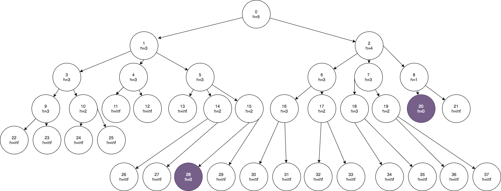
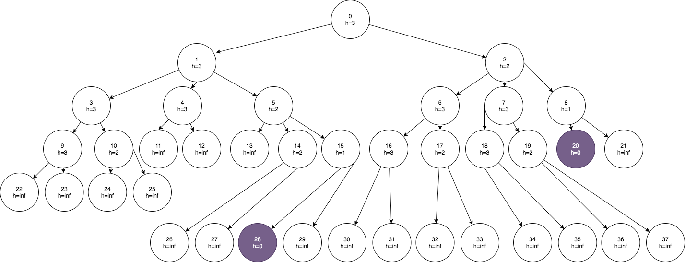

# Tutorial 1 - Classical search and adversarial search 

## Exercise 1

**Question**: How do the following algorithms traverse this state space and which goal do they find?

[Link to image](figure/tut1-ex1.png)

**Answer**:

I assume the cost function is $c(state, action, next\_state) = 1$ (unit step cost). 

| Method | Nodes expanded | Goal found |
| --- | --- | --- |
| BFS | 0, 1, 2, 3, 4, 5, 6, 7, 8, 9, 10, 11, 12, 13, 14, 15, 16, 17, 18, 19, 20 | 20 (optimal) |
| DFS | 0, 1, 3, 9, 22, 23, 10, 24, 25, 4, 11, 12, 5, 13, 14, 26, 27, 15, 28 | 28 |
| Greedy best-first search | 0, 1, 3, 10, 4, 5, 14, 15, 28 | 28 |
| $A^*$ search | 0, 1, 2, 8, 20 | 20 (optimal) |

## Exercise 2

**Question**: How do the following algorithms traverse this state space and which goal do they find?

[Link to image](figure/tut1-ex2.png)

**Answer**: 

I assume the cost function is $c(state, action, next\_state) = 1$ (unit step cost). 

| Method | Nodes expanded | Goal found |
| --- | --- | --- |
| BFS | 0, 1, 2, 3, 4, 5, 6, 7, 8, 9, 10, 11, 12, 13, 14, 15, 16, 17, 18, 19, 20 | 20 (optimal) |
| DFS | 0, 1, 3, 9, 22, 23, 10, 24, 25, 4, 11, 12, 5, 13, 14, 26, 27, 15, 28 | 28 |
| Greedy best-first search | 0, 1, 3, 10, 4, 5, 14, 15, 28 | 28 |
| $A^*$ search | 0, 1, 2, 8, 20 | 20 (optimal) |