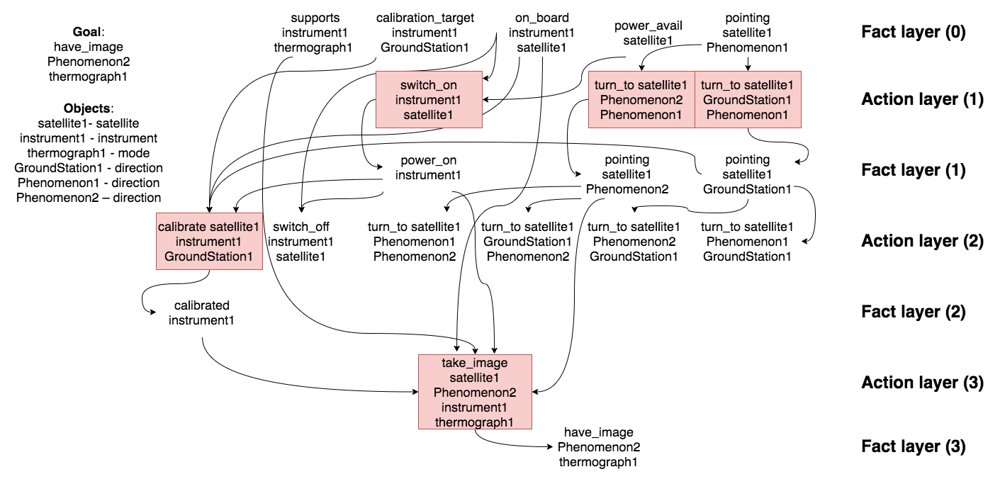

# Tutorial 4 ─ Relaxed Planning Graph Planning 

## Satellite domain

```pddl
(define (domain satellite)

(:requirements :strips :typing)

(:types
    satellite
    instrument
    mode
    direction
)

(:predicates 
    (supports ?i - instrument ?m - mode)
    (calibration_target ?i - instrument ?d - direction)
    (on_board ?i - instrument ?s - satellite)
    (power_avail ?s - satellite)
    (pointing ?s - satellite ?d - direction)
    (have_image ?d - direction ?m - mode)
    (power_on ?i - instrument)
    (calibrated ?i - instrument)
)
; actions 
(:action turn_to
    :parameters (?s - satellite ?d_new - direction ?d_prev - direction)
    :precondition (and 
        (pointing ?s ?d_prev) 
        (not (= ?d_new ?d_prev))
    )
    :effect (and 
        (pointing ?s ?d_new)
        (not (pointing ?s ?d_prev))
    )
)

(:action switch_on
    :parameters (?i - instrument ?s - satellite)
    :precondition (and 
        (on_board ?i ?s) 
        (power_avail ?s)
    )
    :effect (and 
        (power_on ?i)
        (not (calibrated ?i))
        (not (power_avail ?s))
    )
)

(:action switch_off
    :parameters (?i - instrument ?s - satellite)
    :precondition (and 
        (on_board ?i ?s) 
        (power_on ?i)
    )
    :effect (and 
        (not (power_on ?i))
        (power_avail ?s)
    )
)

(:action calibrate
    :parameters (?s - satellite ?i - instrument  ?d - direcion)
    :precondition (and 
        (on_board ?i ?s) 
        (calibration_target ?i ?d)
        (pointing ?s ?d)
        (power_on ?i)
    )
    :effect (and 
        (callibrated ?i)
    )
)

(:action take_image
    :parameters (?s - satellite ?d - direcion ?i - instrument ?m - mode)
    :precondition (and 
        (calibrated ?i)
        (on_board ?i ?s)
        (supports ?i ?m)
        (power_on ?i)
        (pointing ?s ?d)
        (power_on ?i)
    )
    :effect (and 
        (have_image ?d ?m)
    )
)

)
```

## Satellite problem 

```pddl 
(define (problem tutorial_problem) (:domain satellite)
(:objects 
    satellite1 - satellite
    instrument1 - instrument
    thermograph1 - mode 
    GroundStation1 Phenomenon1 Phenomenon2 - direction
)

(:init
    (supports instrument1 thermograph1)
    (calibration_target instrument1 GroundStation1)
    (on_board instrument1 satellite1)
    (power_avail satellite1)
    (pointing satellite1 Phenomenon1)
)

(:goal (and 
    (have_image Phenomenon2 thermograph1)
))

)
```

## How would FF find a solution?

- Build the RPG for the initial state ($S_{init}$).
- Extract a solution from the RPG. 
- Compute the $h$ value for the initial state. 

**Answer**:

The Relaxed Planning Graph starting from the initial state is shown below.
The solution for the relaxed problem is highlighted (the colored actions). This relaxed solution is obtained by working backwards:


[Link to image](figure/tut4-ex1-sol.png)

Working backwards to extract RPG relaxed solution:

| **i** | **f(i)** (Fact Layer) | **g(i)** (Goal Layer) | **$O_i$** (Actions of the relaxed plan) |
| --- | --- | --- | --- |
| 3 | (supports instrument1 thermograph1) (calibration_target instrument1 GroundStation1) (on_board instrument1 satellite1) (power_avail satellite) (pointing satellite1 Phenomenon1) (power_on instrument1) (pointing satellite1 Phenomenon2) (pointing satellite1 GroundState1) (callibrated instrument1) (have_image Phenomenon2 thermograph1) | **(have_image Phenomenon2 thermograph1)** | (take_image satellite1 Phenomenon2 instrument1 thermograph1) | 
| 2 | (supports instrument1 thermograph1) (calibration_target instrument1 GroundStation1) (on_board instrument1 satellite1) (power_avail satellite) (pointing satellite1 Phenomenon1) (power_on instrument1) (pointing satellite1 Phenomenon2) (pointing satellite1 GroundState1) (callibrated instrument1) | **(callibrated instrument1)** (supports instrument1 thermograph1) (on_board instrument1 satellite1) (power_on instrument1) (pointing satellite1 Phenomenon2) | (callibrate satellite1 instrument1 GroundStation1) |
| 1 | (supports instrument1 thermograph1) (calibration_target instrument1 GroundStation1) (on_board instrument1 satellite1) (power_avail satellite) (pointing satellite1 Phenomenon1) (power_on instrument1) (pointing satellite1 Phenomenon2) (pointing satellite1 GroundState1) | (supports instrument1 thermograph1) (on_board instrument1 satellite1) **(power_on instrument1)** **(pointing satellite1 Phenomenon2)** (calibration_target instrument1 GroundStation1) **(pointing satellite1 GroundStation1)** | (switch_on instrument1 satellite1) (turn_to satellite1 Phenomenon2 Phenomenon1) (turn_to satellite1 GroundState1 Phenomenon1) | 
| 0 | (supports instrument1 thermograph1) (calibration_target instrument1 GroundStation1) (on_board instrument1 satellite1) (power_avail satellite) (pointing satellite1 Phenomenon1) | (supports instrument1 thermograph1) (on_board instrument1 satellite1) (calibration_target instrument1 GroundStation1) (power_avail satellite1) (pointing satellite1 Phenomenon1) | | 

> Goals that are not available from the previous fact layer ($s_i$ in $g(i)$ but not in $f(i-1)$) are bolded. 

The $h$ of the initial state is $\Sigma_{i=1}^{m}|O_i| = 5$. 

## Rover domain

## Rover problem

## How would FF find a solution?

