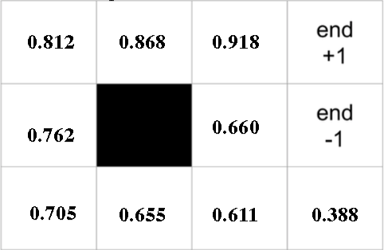

# Tutorial 5 ─ AI under Uncertainty (MDP)

## Bellman Equation

Consider the following utility space. What are the best and worst actions to take in state $(2, 1)$ (0.655)? 

Use the Bellman Equation to show your proof. 

$R(s) = -0.04$

$\gamma = 1$

**Answer**: 

$U(2,1) = -0.04 + \gamma * \max_{\alpha \in A(s)} \sum_{s'} P(s'|s, a) U(s')$

For action $Up$:

$U(2,1) = -0.04 + 1 * (0.8 * U(2,1) + 0.1 * U(1,1) + 0.1 * U(3,1)) = 0.6156$

For action $Left$ (best action):

$U(2,1) = -0.04 + 1 * (0.8 * U(1,1) + 0.2 * U(2,1)) = 0.655$

For action $Right$ (worst action):

$U(2,1) = -0.04 + 1 * (0.8 * U(3,1) + 0.2 * U(2,1)) = 0.5798$

For action $Down$:

$U(2,1) = -0.04 + 1 * (0.8 * U(2,1) + 0.1 * U(1,1) + 0.1 * U(3,1)) = 0.6156$

## Value Iteration

We use the same environment as in the previous exercise, but clear all the utility values except the end states, of course. 

- We start the value iteration algorithm by initialising Utility values as zero:

$U(s) = 0 \forall s \in S$

- We then run the Bellman Update equation for each cell.

- After one full iteration, which $U(s)$ values change and what are the new utility values?

| x \ y | 1 | 2 | 3 | 4 |
| --- | --- | --- | --- | --- |
| 1 | -0.04 | -0.04 | 0.76 | +1 | 
| 2 | -0.04 | -0.04 | -0.04 | -1 | 
| 3 | -0.04 | -0.04 | -0.04 | -0.04 | 

- After two full iterations, which $U(s)$ values have changed from the initial value?

All values have changed. 

| x \ y | 1 | 2 | 3 | 4 |
| --- | --- | --- | --- | --- |
| 1 | -0.08 | **0.56** | **0.832** | +1 | 
| 2 | -0.08 | -0.08 | **0.464** | -1 | 
| 3 | -0.08 | -0.08 | -0.08 | -0.08 | 

> The bolded $U(s)$ values are affected by the end state reward. Observe how the reward is propagating as more iterations are computed.