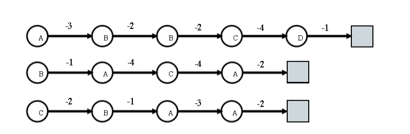

# Tutorial 8 ─ Reinforcement learning 

## Monte Carlo Policy Evaluation

Consider three sample episodes. 

Using First-Visit and Every-Visit, what are $V(s)$ for A and B? 

$\gamma = 1$ (discount factor)

[Link to image](figure/tut8-ex1.png)

**First Visit**: 

First episode: 
$G(A) = -3 + 1^1 * (-2) + 1^2 * (-2) + 1^3 * (-4) + 1^4 * (-1) = -12$ 

Second episode:
$G(A) = -4 + 1^1 * (-4) + 1^2 * (-2) = -10$

Third episode:
$G(A) = -3 + 1^1 * (-2) = -5$ 

$V(A) = \frac{-12-10-5}{3} = -9$

---

First episode: 
$G(B) = -2 + 1^1 * (-2) + 1^2 * (-4) + 1^3 * (-1) = -9$ 

Second episode:
$G(B) = -1 + 1^1 * (-4) + 1^2 * (-4) + 1^3 * (-2)= -11$

Third episode:
$G(B) = -1 + 1^1 * (-3) + 1^2 * (-2)= -6$ 

$V(B) = \frac{-9-11-6}{3} = -\frac{26}{3}$

For First Visit evaluation policy, the state B is better than state A. 

**Every Visit**:

First episode:  
First A: $G(A) = -3 + 1^1 * (-2) + 1^2 * (-2) + 1^3 * (-4) + 1^4 * (-1) = -12$ 

Second episode:  
First A: $G(A) = -4 + 1^1 * (-4) + 1^2 * (-2) = -10$  
Second A: $G(A) = -2$

Third episode:  
First A: $G(A) = -3 + 1^1 * (-2) = -5$  
Second A: $G(A) = -2$

$V(A) = \frac{-12-10-2-5-2}{5} = -6.2$

---

First episode:  
First B: $G(B) = -2 + 1^1 * (-2) + 1^2 * (-4) + 1^3 * (-1) = -9$  
Second B: $G(B) = -2 + 1^1 * (-4) + 1^2 * (-1) = -7$

Second episode:  
First B: $G(B) = -1 + 1^1 * (-4) + 1^2 * (-4) + 1^3 * (-2)= -11$

Third episode:  
First B: $G(B) = -1 + 1^1 * (-3) + 1^2 * (-2)= -6$ 

$V(B) = \frac{-9-7-11-6}{4} = -8.25$

For Every Visit evaluation policy, the state A is better than B. 

## UCT Calculation

Calculate the UCT values for S1 through S3 based on the values presented below. Which state do we select?

$\alpha = 2$ (But the learning rate is not used in UCT)

| State | Total simulations | Win rate |
| --- | --- | --- |
| $S_0$ | 50 | - |
| $S_1$ | 15 | 10 |
| $S_2$ | 15 | 5 |
| $S_3$ | 20 | 10 |

**Answer**: 

**$UCT(S1) = \frac{10}{15} + \sqrt{2} \sqrt{\frac{\ln{50}}{15}} = 1.177$**

$UCT(S2) = \frac{2}{15} + \sqrt{2} \sqrt{\frac{\ln{50}}{15}} = 0.8556$

$UCT(S3) = \frac{10}{20} + \sqrt{2} \sqrt{\frac{\ln{50}}{20}} = 1.125$

Therefore, we select $S1$ to expand. 