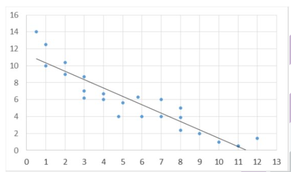
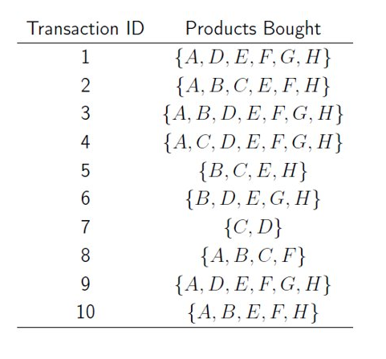

# Revision questions

## Search algorithms

| Algorithm | Complete | Optimal | DST | Heuristics or costs |
| --- | --- | --- | --- | --- |
| BFS | Yes | Yes (for uniform cost) | Queue | None |
| DFS | Incomplete if there are loops | No | Stack | None |
| Uniform cost search | Yes | Yes | Priority queue | Costs |
| Best-First search | Yes | No | Priority queue | Heuristic |
| $A^*$ search | Yes | Yes | Priority queue | Heuristic + costs |

## Heuristics 

What terms do we use to address the following concepts in heuristic design?

**Heuristic never overestimates the value of a state in relation to the goal**: Admissible

**Heuristic is calculated by removing constraints of the original problem**: Relaxed

## CSP

- Variables: A, B, C
- Domains for all variables: $\{1,2,3,4,5\}$
- Constraints: $C < B$, $B < A$

How many solutions exist for this CSP?

**Answer**:

1. `REVISE(B, A)` $\to$ prune $1$ from $dom(B)$
2. `REVISE(C, B)` $\to$ prune $1$ and $2$ from $dom(C)$

$\ldots$

After the arc consistency preprocessing, 

1. $dom(A) = \{1,2,3\}$
2. $dom(B) = \{2,3,4\}$
3. $dom(C) = \{3,4,5\}$

There are $(3+2+1) + (2+1) + (1) = 10$ solutions. 

## Distance Metrics

Calculate the Euclidean distance between $X_1 = [3.0, 2.0, 6.0, 3.0, 2.0, 6.0]$ and $X_2 = [1.0, 2.0, 4.0, 1.0, 2.0, 4.0]$. 

**Answer**: $\sqrt{(3-1)^2 + (2-2)^2 + (6-4)^2 + (3-1)^2 + (2-2)^2 + (6-4)^2} = 4$.

## Correlations

What is the best description of the regression line?

[Link to image](figure/tut9-ex1.png)

**Answer**: There is negative correlation between the variables and the regression line has slope coefficient $-0.99$ and an intercept of $11.3$. 

## Association Rules

Consider the set of transactions to the right, what is the confidence of the association rule $\{H\} \to \{F, G\}$?

Based on this confidence, what does this mean about the probability of $H$ appearing in a transaction?

[Link to image](figure/tut9-ex2.png)

**Answer**:

Confidence is $\frac{4 / 10}{8 / 10} = 0.5$. 

This means that $H$ has probability $80 %$ of appearing in a transaction. And if a transaction contains $H$, there is $50 %$ that the transaction will also contain $F$ and $G$. 